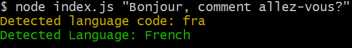

# LangDetect

A simple command-line tool to detect the language of a given text using:

- [`franc`](https://www.npmjs.com/package/franc) for language detection
- [`langs`](https://www.npmjs.com/package/langs) for mapping ISO 639-3 codes to readable names
- [`colors`](https://www.npmjs.com/package/colors) for colorized console output

---

## Features

- Detects the language of input text based on statistical analysis.
- Provides the language name and ISO 639-3 code.
- Handles cases where the language cannot be determined or is unsupported.
- Encourages longer input for better accuracy
- Outputs colorized, readable messages in the terminal

---

## Usage

1. Clone the repository:
   ```bash
   git clone https://github.com/Misba0019/LangDetect.git
   cd LangDetect
   
2. Install dependencies:
   ```bash
   npm install

3. Run the tool:
   ```bash
   node index.js "Your text here"

- Example: 
  ```bash
  node index.js "Hello, this tool can guess different languages."
- Output: 
  ```bash
  Detected language code: eng
  The language appears to be: English

---

## Example Output Preview

Here’s what a sample run looks like:


---

## Requirements

- Node.js (version 18 or higher)

---

## How It Works

1. The tool takes a text input from the command line.

2. It uses the `franc` library to detect the language code.

3. The `langs` library maps the detected code to a language name.

4. If the language cannot be determined (`und`) or is unsupported, the tool provides feedback to the user.

---

## Limitations

- Short or ambiguous text may return `und` (undefined)

- Some rare languages may not be supported by the `langs` package.

---

## Credits

Powered by the open-source libraries:

- [franc](https://github.com/wooorm/franc/tree/main)
- [langs](https://github.com/adlawson/nodejs-langs)
- [colors](https://github.com/Marak/colors.js)

--- 
## License
This project is licensed under the MIT License. See the [LICENSE](LICENSE) file for details.